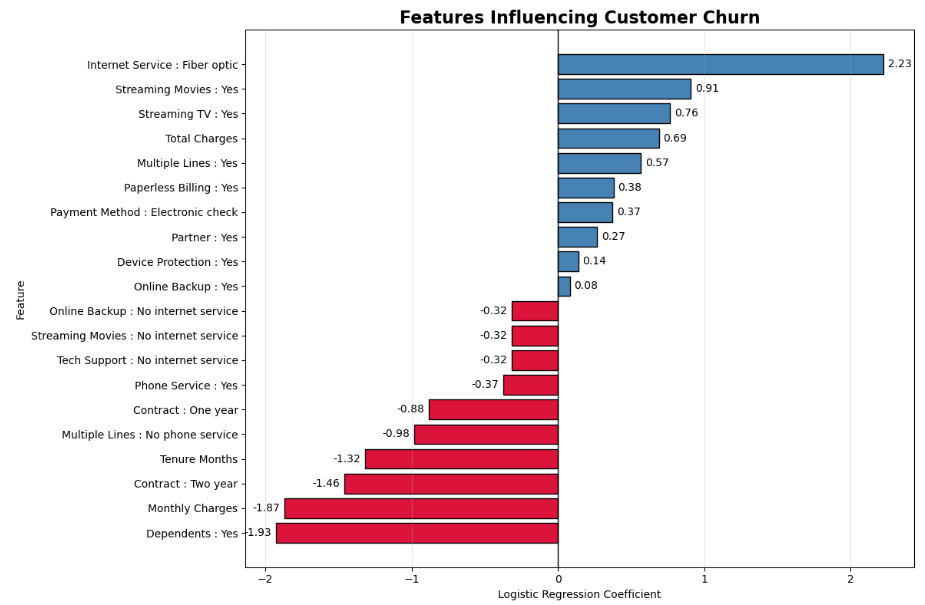

# 📉 Customer Churn Prediction using Machine Learning

Predicting customer churn using machine learning techniques to identify customers at risk of leaving and uncover the key factors influencing customer retention.

## 📌 Project Overview

Customer churn is one of the biggest challenges faced by subscription-based businesses. Retaining existing customers is often more cost-effective than acquiring new ones, making churn prediction an important business problem.

This project develops a machine learning model to predict customer churn using customer demographics, subscription information, billing details, and service usage data. The project follows an end-to-end machine learning workflow, from data cleaning and exploratory data analysis (EDA) to model development, evaluation, interpretation, and business recommendations.

## 🎯 Objectives

- Develop a machine learning model to predict customer churn.
- Compare the performance of multiple classification algorithms.
- Identify the most important factors influencing customer churn.
- Generate business recommendations based on model findings.

## 📊 Dataset

**Dataset:** IBM Telco Customer Churn Dataset

The dataset contains customer demographic information, subscription details, billing information, internet services, contract types, and customer churn status.

**Target Variable**

- Churn Value
    - 1 = Customer churned
    - 0 = Customer retained

## 🛠 Technologies Used

- Python
- Pandas
- NumPy
- Matplotlib
- Seaborn
- Scikit-learn
- XGBoost
- Imbalanced-learn (SMOTE)
- Jupyter Notebook

## ⚙️ Machine Learning Workflow

The project follows an end-to-end machine learning pipeline:

- ✅ Data Cleaning
- ✅ Exploratory Data Analysis (EDA)
- ✅ Feature Engineering
- ✅ Train-Test Split
- ✅ Data Preprocessing using `ColumnTransformer`
- ✅ Feature Scaling with `StandardScaler`
- ✅ One-Hot Encoding for Categorical Variables
- ✅ Handling Class Imbalance using SMOTE
- ✅ Model Development
  - Logistic Regression
  - Random Forest
  - XGBoost
- ✅ Hyperparameter Tuning using `RandomizedSearchCV`
- ✅ Model Evaluation
- ✅ Feature Importance Analysis
- ✅ Business Recommendations

## 📈 Model Performance

The performance of three classification models was evaluated using Accuracy, Precision, Recall, F1-Score, and ROC-AUC.

| Model | Accuracy | Precision | Recall | F1-Score | ROC-AUC |
|:------|---------:|----------:|--------:|---------:|---------:|
| Logistic Regression | 0.746 | 0.514 | **0.775** | 0.618 | **0.847** |
| Random Forest | 0.779 | 0.583 | 0.594 | 0.588 | 0.835 |
| XGBoost | **0.792** | **0.611** | 0.596 | 0.604 | 0.839 |

> **Final Model:** Logistic Regression

Although XGBoost achieved the highest overall accuracy, Logistic Regression was selected as the final model because it produced the highest Recall and ROC-AUC. Since the primary objective is to identify customers likely to churn, Recall was prioritized to minimize false negatives.

## 🧪 Feature Selection Experiment

An experiment was conducted to evaluate whether **Customer Lifetime Value (CLTV)** improved prediction performance.

Three machine learning models were trained twice:

- With CLTV
- Without CLTV

The evaluation metrics remained identical across all models, indicating that CLTV did not provide additional predictive value for this dataset.

Therefore, CLTV was excluded from the final model to simplify the feature set without sacrificing predictive performance.

## ⚡ Hyperparameter Tuning

Hyperparameter tuning was performed using **RandomizedSearchCV** with 5-fold cross-validation.

The Logistic Regression model was optimized using Recall as the scoring metric.

The best configuration was:

- Regularization (C): **100**
- Penalty: **L2**
- Solver: **liblinear**

The tuned model produced only marginal improvements compared to the baseline model, indicating that the default Logistic Regression parameters were already well suited for the dataset.

## 📊 Feature Importance

The final Logistic Regression model was interpreted using feature coefficients to identify the variables that most strongly influenced customer churn.

Key findings include:

- Fiber Optic Internet Service was the strongest positive predictor of churn.
- Customers with longer tenure were less likely to churn.
- Customers on two-year contracts demonstrated significantly lower churn risk.
- Customers with dependents exhibited stronger customer retention.

The figure below illustrates the most influential features identified by the model.

  

## 💼 Business Recommendations

Based on the model findings, the following recommendations are proposed to reduce customer churn:

- Encourage customers to switch from month-to-month contracts to one- or two-year contracts through loyalty rewards or promotional discounts.
- Prioritize retention campaigns for customers subscribed to Fiber Optic Internet Service, as this group demonstrated the highest churn risk.
- Improve customer engagement during the early stages of the customer lifecycle, since customers with longer tenure were less likely to churn.
- Monitor customers using Electronic Check and Paperless Billing, as these groups exhibited a higher tendency to churn and may benefit from targeted retention strategies.
- Continue developing products and services that appeal to family-oriented customers, as customers with dependents demonstrated stronger customer retention.

## 🚀 Future Improvements

Potential future enhancements for this project include:

- Develop an interactive Power BI dashboard to visualize customer churn predictions.
- Deploy the trained machine learning model using Streamlit or Flask.
- Evaluate additional machine learning algorithms and ensemble techniques.
- Incorporate new customer behavior data to improve predictive performance.
- Implement automated model retraining using updated customer data.

## 📝 Conclusion

This project demonstrates an end-to-end machine learning workflow for customer churn prediction, from data preprocessing and exploratory analysis to model development, evaluation, and business interpretation.

The final Logistic Regression model achieved the best balance of predictive performance and interpretability, making it a suitable choice for identifying customers at risk of churn and supporting customer retention strategies.

## 👤 Author

**Nabilah Nordin**

- 🎓 Bachelor of Computer Science (Data Science)
- 📍 Malaysia
- 💼 Aspiring Data Analyst / Data Scientist

### Connect with me

[LinkedIn] https://www.linkedin.com/in/nur-nabilah-nordin-b79111146/
